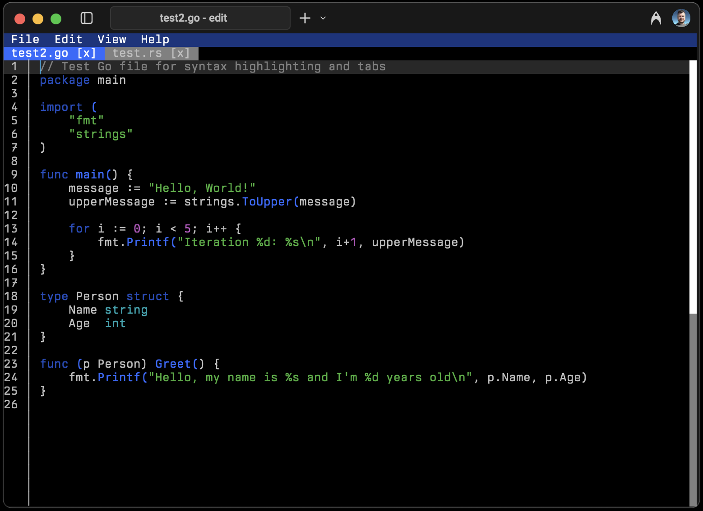

#  Edit

A simple editor for simple needs.

This editor pays homage to the classic [MS-DOS Editor](https://en.wikipedia.org/wiki/MS-DOS_Editor), but with a modern interface and input controls similar to VS Code. The goal is to provide an accessible editor that even users largely unfamiliar with terminals can easily use.

## Installation

Platform | Instructions
---------|-------------
Windows (Winget) | `winget install Microsoft.Edit`
Other | You can download binaries from our [releases page](https://github.com/microsoft/edit/releases/latest). (Windows packages include a PDB file which can be deleted.)

### Notes to Package Maintainers

The canonical executable name is "edit" and the alternative name is "msedit".

We're aware of the potential conflict of "edit" with existing commands and as such recommend naming packages and executables "msedit".
Names such as "ms-edit" should be avoided.
Assigning an "edit" alias is recommended if possible.

## Build Instructions

* [Install Rust](https://www.rust-lang.org/tools/install)
* Install the nightly toolchain: `rustup install nightly`
  * Alternatively, set the environment variable `RUSTC_BOOTSTRAP=1`
* Clone the repository
* For a release build, run: `cargo build --config .cargo/release.toml --release`
